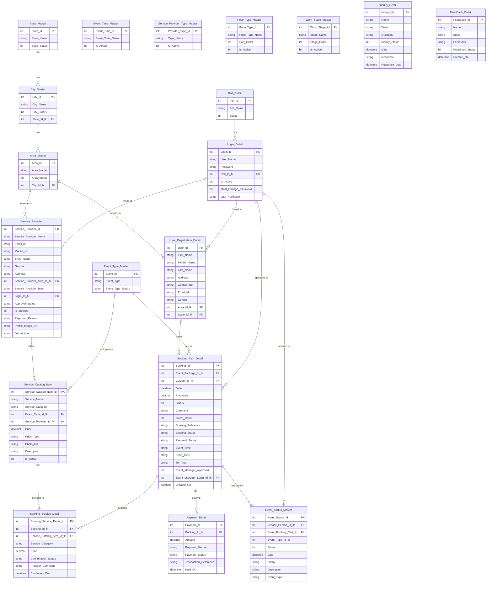

# E-Zone It — Online Event Management System
### Complete Project Documentation

> **Project Name:** E-Zone It  
> **Framework:** ASP.NET Core 8.0 MVC  
> **Database:** SQL Server (LocalDB / MSSQLLocalDB)  
> **Architecture:** Multi-portal, Role-based Web Application  
> **Author:** Hitesh Dhandhla  

---

## Table of Contents

1. [Project Overview](#1-project-overview)
2. [System Architecture](#2-system-architecture)
3. [Technology Stack](#3-technology-stack)
4. [User Roles & Portals](#4-user-roles--portals)
5. [Database Design](#5-database-design)
   - [Entity Relationship Diagram](#51-entity-relationship-diagram)
   - [Table Definitions](#52-table-definitions)
   - [Foreign Key Relationships](#53-foreign-key-relationships)
6. [Data Flow Diagrams](#6-data-flow-diagrams)
7. [System Workflows](#7-system-workflows)
   - [User Registration Flow](#71-user-registration-flow)
   - [Login & Session Flow](#72-login--session-flow)
   - [Event Booking Flow](#73-event-booking-flow)
   - [Service Provider Approval Flow](#74-service-provider-approval-flow)
   - [Service Confirmation & Work Progress Flow](#75-service-confirmation--work-progress-flow)
   - [Payment Flow](#76-payment-flow)
8. [Controllers & Actions](#8-controllers--actions)
9. [ViewModels](#9-viewmodels)
10. [Views Structure](#10-views-structure)
11. [Application Constants](#11-application-constants)
12. [Master Data](#12-master-data)
13. [Security Model](#13-security-model)
14. [Configuration](#14-configuration)
15. [Project Statistics](#15-project-statistics)

---

## 1. Project Overview

**E-Zone It** is a full-featured online event management platform that connects customers, service providers, and event managers in a single unified web application. It enables customers to book events end-to-end — selecting venues, caterers, decorators, music providers, and transporters — while giving administrators complete control over service approvals, geography management, and inquiry handling.

### Core Objectives

| # | Objective |
|---|-----------|
| 1 | Allow customers to book events by selecting services from registered providers |
| 2 | Allow service providers to register, get approved, list services, and track their orders |
| 3 | Allow event managers to review and approve bookings before payment |
| 4 | Allow administrators to manage geography, event types, providers, staff, and inquiries |
| 5 | Allow customers to track real-time work-stage progress from service providers |
| 6 | Provide inquiry and feedback channels for public visitors |

---

## 2. System Architecture

```
┌─────────────────────────────────────────────────────────────┐
│                    E-Zone It Web App                        │
│                  ASP.NET Core 8.0 MVC                       │
├─────────────┬──────────────┬─────────────┬──────────────────┤
│   Visitor   │    Admin     │  Customer   │  Service Person  │
│   Portal    │   Portal     │   Portal    │     Portal       │
│  (Public)   │ (Admin Role) │(Customer    │(ServiceProvider  │
│             │              │  Role)      │   Role)          │
├─────────────┴──────────────┴─────────────┴──────────────────┤
│              Event Manager Portal                           │
│         (Event Manager / Event Planner Roles)               │
├─────────────────────────────────────────────────────────────┤
│                   MVC Controllers Layer                     │
│   Home | Account | Admin | Customer | ServiceProvider |     │
│                   EventManager                              │
├─────────────────────────────────────────────────────────────┤
│              Entity Framework Core 9.0 (ORM)               │
├─────────────────────────────────────────────────────────────┤
│                SQL Server (LocalDB)                         │
│              Database: Event_Management                     │
└─────────────────────────────────────────────────────────────┘
```

### Request-Response Flow

```
Browser → HTTP Request
    → Routing (Program.cs: {controller}/{action}/{id?})
    → Controller Action
        → Session Auth Check (Role Guard)
        → Business Logic
        → EF Core → SQL Server
    → ViewModel / ViewBag / ViewData
    → Razor View (.cshtml)
    → HTML Response → Browser
```

---

## 3. Technology Stack

### Backend

| Component | Technology | Version |
|-----------|-----------|---------|
| Framework | ASP.NET Core MVC | 8.0 |
| Language | C# | 12 |
| ORM | Entity Framework Core | 9.0.15 |
| DB Driver | EF Core SQL Server | 9.0.15 |
| DB Design | EF Core Relational | 9.0.15 |
| DB Design Tools | EF Core Design | 9.0.15 |

### Frontend

| Component | Technology |
|-----------|-----------|
| Markup | Razor (.cshtml) |
| CSS Framework | Bootstrap 5.x |
| JavaScript | jQuery |
| Form Validation | jQuery Validation + Unobtrusive |

### Database

| Component | Detail |
|-----------|--------|
| Engine | SQL Server |
| Instance | LocalDB (MSSQLLocalDB) |
| Database Name | Event_Management |
| Connection | Trusted / Windows Auth |

### Infrastructure

| Component | Detail |
|-----------|--------|
| Session | ASP.NET Core Session (cookie-based) |
| File Storage | wwwroot/uploads (local disk) |
| Migrations | EF Core Code-First Migrations |

---

## 4. User Roles & Portals

The system has **5 user roles** mapped to **5 portals**:

```
┌─────────────────────────────────────────────────────────────────┐
│                        PORTAL MAP                               │
│                                                                 │
│  ┌───────────┐  ┌───────────┐  ┌───────────┐  ┌────────────┐  │
│  │  VISITOR  │  │   ADMIN   │  │ CUSTOMER  │  │  SERVICE   │  │
│  │  (Public) │  │           │  │           │  │  PROVIDER  │  │
│  │           │  │ Full sys  │  │  Book     │  │            │  │
│  │ Home      │  │ control   │  │  events   │  │  Confirm   │  │
│  │ About     │  │ Geography │  │  Track    │  │  services  │  │
│  │ Contact   │  │ Providers │  │  status   │  │  Update    │  │
│  │ Register  │  │ Staff     │  │  Payments │  │  progress  │  │
│  │           │  │ Inquiries │  │  Feedback │  │  photos    │  │
│  └───────────┘  └───────────┘  └───────────┘  └────────────┘  │
│                                                                 │
│                   ┌───────────────────┐                        │
│                   │  EVENT MANAGER /  │                        │
│                   │  EVENT PLANNER    │                        │
│                   │                   │                        │
│                   │  Review bookings  │                        │
│                   │  Approve orders   │                        │
│                   └───────────────────┘                        │
└─────────────────────────────────────────────────────────────────┘
```

### Role Details

| Role | DB Value | Access | Can Login |
|------|----------|--------|-----------|
| Admin | `Admin` | Full system management | Yes |
| Customer | `Customer` | Book events, track, pay, feedback | Yes |
| Event Manager | `Event Manager` | Approve/reject bookings | Yes |
| Event Planner | `Event Planner` | View bookings (read-only) | Yes |
| Service Provider | `Service Provider` | Manage services, confirm orders, update work stages | Yes |

### Session Keys

| Key | Value Stored |
|-----|-------------|
| `UserId` | Login_Id of the logged-in user |
| `UserName` | User_Name (email) |
| `Role` | Roll_Name |

---

## 5. Database Design

### 5.1 Entity Relationship Diagram



---

### 5.2 Table Definitions

#### Roll_Detail — User Roles

| Column | Data Type | Constraints | Description |
|--------|-----------|-------------|-------------|
| Roll_Id | int | PK, Identity | Primary key |
| Roll_Name | nvarchar(50) | Required | Role name |
| Status | bit | | Active/Inactive |

**Seeded Values:** Admin, Customer, Event Manager, Event Planner, Service Provider

---

#### Login_Detail — Authentication

| Column | Data Type | Constraints | Description |
|--------|-----------|-------------|-------------|
| Login_Id | int | PK, Identity | Primary key |
| User_Name | nvarchar(50) | Required | Email / username used to login |
| Password | nvarchar(20) | Required | Plain-text password |
| Roll_Id_fk | int | FK → Roll_Detail | User's assigned role |
| Is_Active | bit | Default: true | Account enabled flag |
| Must_Change_Password | bit | | Forces password change on next login |
| Last_Notification | nvarchar(250) | | Last system message shown to user |

---

#### User_Registration_Detail — Customer & Staff Profiles

| Column | Data Type | Constraints | Description |
|--------|-----------|-------------|-------------|
| User_Id | int | PK, Identity | Primary key |
| First_Name | nvarchar(50) | Required | First name |
| Middle_Name | nvarchar(50) | | Middle name |
| Last_Name | nvarchar(50) | Required | Last name |
| Address | nvarchar(50) | | Residential address |
| Contact_No | nvarchar(10) | | Mobile number |
| Email_Id | nvarchar(30) | | Email address |
| Gender | nvarchar(10) | | Male / Female |
| Area_Id_fk | int | FK → Area_Master | Residential area |
| Login_Id_fk | int | FK → Login_Detail | Linked login account |

---

#### State_Master — States / Provinces

| Column | Data Type | Constraints | Description |
|--------|-----------|-------------|-------------|
| State_Id | int | PK, Identity | Primary key |
| State_Name | nvarchar(50) | Required | State name |
| State_Status | bit | Default: true | Active/Inactive |

**Seeded Values:** Gujarat, Maharashtra

---

#### City_Master — Cities

| Column | Data Type | Constraints | Description |
|--------|-----------|-------------|-------------|
| City_Id | int | PK, Identity | Primary key |
| City_Name | nvarchar(50) | Required | City name |
| City_Status | bit | | Active/Inactive |
| State_Id_fk | int | FK → State_Master | Parent state |

**Seeded Values:** Surat, Ahmedabad (Gujarat) · Mumbai (Maharashtra)

---

#### Area_Master — Areas / Localities

| Column | Data Type | Constraints | Description |
|--------|-----------|-------------|-------------|
| Area_Id | int | PK, Identity | Primary key |
| Area_Name | nvarchar(50) | Required | Area / locality name |
| Area_Status | bit | | Active/Inactive |
| City_Id_fk | int | FK → City_Master | Parent city |

**Seeded Values:** Vesu, Adajan (Surat) · Satellite (Ahmedabad) · Andheri (Mumbai)

---

#### Event_Type_Master — Event Categories

| Column | Data Type | Constraints | Description |
|--------|-----------|-------------|-------------|
| Event_Id | int | PK, Identity | Primary key |
| Event_Type | nvarchar(50) | Required | Type name |
| Event_Type_Status | nvarchar(50) | Required | `Active` / `Inactive` |

**Seeded Values:** Wedding, Birthday, Corporate, Reception

---

#### Event_Time_Master — Time Slots

| Column | Data Type | Constraints | Description |
|--------|-----------|-------------|-------------|
| Event_Time_Id | int | PK, Identity | Primary key |
| Event_Time_Name | nvarchar(30) | Required | Slot name |
| Is_Active | bit | Default: true | Active/Inactive |

**Seeded Values:** Breakfast, Lunch, Evening, Dinner, Full Day

---

#### Service_Provider_Type_Master — Provider Categories

| Column | Data Type | Constraints | Description |
|--------|-----------|-------------|-------------|
| Provider_Type_Id | int | PK, Identity | Primary key |
| Type_Name | nvarchar(50) | Required | Category name |
| Is_Active | bit | Default: true | Active/Inactive |

**Seeded Values:** Party Plot, Caterer, Decoration, Music, Transporter

---

#### Price_Type_Master — Pricing Models

| Column | Data Type | Constraints | Description |
|--------|-----------|-------------|-------------|
| Price_Type_Id | int | PK, Identity | Primary key |
| Price_Type_Name | nvarchar(50) | Required | Pricing type label |
| Sort_Order | int | | Display order |
| Is_Active | bit | Default: true | Active/Inactive |

**Seeded Values:** For All, Per Plate, Per Person, Per Event, Per Trip, Per Hour, 100 Guest

---

#### Work_Stage_Master — Work Progress Stages

| Column | Data Type | Constraints | Description |
|--------|-----------|-------------|-------------|
| Work_Stage_Id | int | PK, Identity | Primary key |
| Stage_Name | nvarchar(50) | Required | Stage label |
| Stage_Order | int | | Sequence number |
| Is_Active | bit | Default: true | Active/Inactive |

**Seeded Values (in order):**

| Stage Order | Stage Name |
|-------------|-----------|
| 1 | Confirm |
| 2 | Collect Material |
| 3 | Reached |
| 4 | Work Start |
| 5 | Work Running |
| 6 | Work Finish |

---

#### Service_Provider — Service Provider Profiles

| Column | Data Type | Constraints | Description |
|--------|-----------|-------------|-------------|
| Service_Provider_Id | int | PK, Identity | Primary key |
| Service_Provider_Name | nvarchar(50) | Required | Provider's full name |
| Email_Id | nvarchar(30) | | Business email |
| Mobile_No | nvarchar(15) | | Mobile number |
| Shop_Name | nvarchar(100) | | Business / shop name |
| Gender | nvarchar(10) | | Male / Female |
| Address | nvarchar(50) | | Business address |
| Service_Provider_Area_Id_fk | int | FK → Area_Master | Operating area |
| Service_Provider_Type | nvarchar(50) | | Category (Party Plot, Caterer, etc.) |
| Login_Id_fk | int | FK → Login_Detail | Linked login account |
| Approval_Status | nvarchar(30) | Default: "Pending" | Pending / Approved / Rejected |
| Is_Blocked | bit | | Blocked by admin |
| Rejection_Reason | nvarchar(200) | | Reason if rejected |
| Profile_Image_Url | nvarchar(500) | | Profile photo URL |
| Description | nvarchar(1000) | | Business description |

---

#### Service_Catalog_Item — Service Listings

| Column | Data Type | Constraints | Description |
|--------|-----------|-------------|-------------|
| Service_Catalog_Item_Id | int | PK, Identity | Primary key |
| Service_Name | nvarchar(80) | Required | Service display name |
| Service_Category | nvarchar(50) | Required | Category (matches provider type) |
| Event_Type_Id_fk | int | FK → Event_Type_Master | Applicable event type |
| Service_Provider_Id_fk | int? | FK → Service_Provider | Owner provider (nullable) |
| Price | decimal(15,2) | | Base price |
| Price_Type | nvarchar(30) | Default: "For All" | Pricing model |
| Photo_Url | nvarchar(500) | | Service photo |
| Description | nvarchar(1000) | | Service description |
| Is_Active | bit | Default: true | Visible to customers |

---

#### Booking_Cart_Detail — Event Bookings

| Column | Data Type | Constraints | Description |
|--------|-----------|-------------|-------------|
| Booking_Id | int | PK, Identity | Primary key |
| Event_Package_Id_fk | int | FK → Event_Type_Master | Event category |
| Custom_Id_fk | int | FK → User_Registration_Detail | Customer |
| Date | datetime2 | | Event date |
| Ammount | decimal(15,2) | | Total booking amount |
| Status | bit | | General status flag |
| Comment | nvarchar(50) | | Customer note |
| Guest_Count | int | | Expected number of guests |
| Booking_Reference | nvarchar(40) | Required | Unique reference (GUID-based) |
| Booking_Status | nvarchar(40) | Default: "Pending" | Current status |
| Payment_Status | nvarchar(40) | Default: "Pending" | Payment state |
| Event_Time | nvarchar(30) | Required | Time slot name |
| From_Time | nvarchar(10) | Required | Start time |
| To_Time | nvarchar(10) | Required | End time |
| Event_Manager_Approved | bit | | Manager approval flag |
| Event_Manager_Login_Id_fk | int? | FK → Login_Detail | Manager who approved |
| Created_On | datetime2 | Default: UTC Now | Booking creation timestamp |

**Booking_Status values:**

| Status | Meaning |
|--------|---------|
| `Pending Event Manager Approval` | Awaiting event manager review |
| `Confirmed by Event Manager` | Approved, ready for payment |
| `Paid` | Payment received |
| `Cancelled` | Booking cancelled |

---

#### Booking_Service_Detail — Services in a Booking

| Column | Data Type | Constraints | Description |
|--------|-----------|-------------|-------------|
| Booking_Service_Detail_Id | int | PK, Identity | Primary key |
| Booking_Id_fk | int | FK → Booking_Cart_Detail | Parent booking |
| Service_Catalog_Item_Id_fk | int | FK → Service_Catalog_Item | Selected service |
| Service_Category | nvarchar(50) | Required | Category at time of booking |
| Price | decimal(15,2) | | Price locked at booking |
| Confirmation_Status | nvarchar(50) | Default: "Pending" | Pending / Confirmed |
| Provider_Comment | nvarchar(200) | | Provider's acceptance note |
| Confirmed_On | datetime2? | | When provider confirmed |

---

#### Event_Status_Master — Work Stage Progress

| Column | Data Type | Constraints | Description |
|--------|-----------|-------------|-------------|
| Event_Status_Id | int | PK, Identity | Primary key |
| Service_Person_Id_fk | int | FK → Login_Detail | Provider who updated |
| Event_Booking_Cart_fk | int | FK → Booking_Cart_Detail | Associated booking |
| Event_Type_Id_fk | int | | Event type reference |
| Status | bit | | Active/done flag |
| Date | datetime2 | | Update timestamp |
| Photo | nvarchar(500) | | Progress photo URL |
| Description | nvarchar(1000) | | Stage description / notes |
| Event_Type | nvarchar(100) | | Event/service type label |

---

#### Payment_Detail — Payment Records

| Column | Data Type | Constraints | Description |
|--------|-----------|-------------|-------------|
| Payment_Id | int | PK, Identity | Primary key |
| Booking_Id_fk | int | FK → Booking_Cart_Detail | Associated booking |
| Amount | decimal(15,2) | | Amount paid |
| Payment_Method | nvarchar(50) | Required | Method (Credit Card, Cash, etc.) |
| Payment_Status | nvarchar(50) | Required | Pending / Paid |
| Transaction_Reference | nvarchar(50) | Required | Transaction / reference ID |
| Paid_On | datetime2 | | Payment timestamp |

---

#### Inquiry_Detail — Customer Inquiries

| Column | Data Type | Constraints | Description |
|--------|-----------|-------------|-------------|
| Inquiry_Id | int | PK, Identity | Primary key |
| Name | nvarchar(50) | | Inquirer's name |
| Email | nvarchar(30) | Required | Inquirer's email |
| Question | nvarchar(250) | Required | Inquiry question |
| Inquiry_Status | bit | | Open / Responded |
| Date | datetime2 | | Submission date |
| Response | nvarchar(500) | Required | Admin's response text |
| Response_Date | datetime2 | | When response was given |

---

#### FeedBack_Detail — Customer Feedback

| Column | Data Type | Constraints | Description |
|--------|-----------|-------------|-------------|
| FeedBack_Id | int | PK, Identity | Primary key |
| Name | nvarchar(15) | | Submitter's name |
| Email | nvarchar(30) | | Submitter's email |
| FeedBack | nvarchar(max) | Required | Feedback text |
| FeedBack_Status | bit | | Read / Unread |
| Created_On | datetime2 | Default: UTC Now | Submission timestamp |

---

### 5.3 Foreign Key Relationships

| Child Table | Child Column | Parent Table | Parent Column | On Delete |
|-------------|-------------|--------------|---------------|-----------|
| Login_Detail | Roll_Id_fk | Roll_Detail | Roll_Id | Restrict |
| User_Registration_Detail | Login_Id_fk | Login_Detail | Login_Id | Cascade |
| User_Registration_Detail | Area_Id_fk | Area_Master | Area_Id | Cascade |
| Service_Provider | Login_Id_fk | Login_Detail | Login_Id | Cascade |
| Service_Provider | Service_Provider_Area_Id_fk | Area_Master | Area_Id | Cascade |
| City_Master | State_Id_fk | State_Master | State_Id | Cascade |
| Area_Master | City_Id_fk | City_Master | City_Id | Cascade |
| Service_Catalog_Item | Event_Type_Id_fk | Event_Type_Master | Event_Id | Cascade |
| Service_Catalog_Item | Service_Provider_Id_fk | Service_Provider | Service_Provider_Id | Restrict |
| Booking_Cart_Detail | Event_Package_Id_fk | Event_Type_Master | Event_Id | Cascade |
| Booking_Cart_Detail | Custom_Id_fk | User_Registration_Detail | User_Id | Cascade |
| Booking_Cart_Detail | Event_Manager_Login_Id_fk | Login_Detail | Login_Id | No Action |
| Booking_Service_Detail | Booking_Id_fk | Booking_Cart_Detail | Booking_Id | Cascade |
| Booking_Service_Detail | Service_Catalog_Item_Id_fk | Service_Catalog_Item | Service_Catalog_Item_Id | Restrict |
| Event_Status_Master | Event_Booking_Cart_fk | Booking_Cart_Detail | Booking_Id | Cascade |
| Event_Status_Master | Service_Person_Id_fk | Login_Detail | Login_Id | No Action |
| Payment_Detail | Booking_Id_fk | Booking_Cart_Detail | Booking_Id | Cascade |

---

## 6. Data Flow Diagrams

### Level 0 — Context Diagram

```
                        ┌───────────────────────┐
    Visitor  ──────────►│                       │◄──────────── Admin
                        │                       │─────────────► Admin
    Customer ──────────►│     E-ZONE IT         │
             ◄──────────│   Online Event        │◄──────────── Event Manager
                        │   Management System   │─────────────► Event Manager
    Service  ──────────►│                       │
    Provider ◄──────────│                       │
                        └───────────────────────┘
```

### Level 1 — Main Processes

```
┌────────────────────────────────────────────────────────────────────┐
│                        E-ZONE IT SYSTEM                            │
│                                                                    │
│  ┌──────────────┐    ┌──────────────┐    ┌──────────────────────┐ │
│  │  1.0         │    │  2.0         │    │  3.0                 │ │
│  │  User Mgmt   │    │  Geography   │    │  Service Mgmt        │ │
│  │              │    │  Mgmt        │    │                      │ │
│  │  Register    │    │  State/City/ │    │  Register Provider   │ │
│  │  Login       │    │  Area CRUD   │    │  Approve Provider    │ │
│  │  Change Pass │    │              │    │  Add Services        │ │
│  └──────────────┘    └──────────────┘    └──────────────────────┘ │
│                                                                    │
│  ┌──────────────┐    ┌──────────────┐    ┌──────────────────────┐ │
│  │  4.0         │    │  5.0         │    │  6.0                 │ │
│  │  Booking     │    │  Payment     │    │  Inquiry &           │ │
│  │  Mgmt        │    │  Processing  │    │  Feedback            │ │
│  │              │    │              │    │                      │ │
│  │  Book Event  │    │  Process Pay │    │  Submit Inquiry      │ │
│  │  Mgr Approve │    │  Record Txn  │    │  Admin Respond       │ │
│  │  Track Status│    │              │    │  Submit Feedback     │ │
│  └──────────────┘    └──────────────┘    └──────────────────────┘ │
└────────────────────────────────────────────────────────────────────┘
```

---

## 7. System Workflows

### 7.1 User Registration Flow

#### Customer Registration

```
Customer visits /Account/Register
         │
         ▼
    Fill form: Name, Email, Password, Address, Gender, Area
         │
         ▼
    Submit POST /Account/Register
         │
         ▼
    ┌─ Validate ──────────────────────┐
    │  • Passwords match?             │──── No ──► Show error
    │  • Email not already used?      │──── No ──► Show error
    └─────────────────────────────────┘
         │ Yes
         ▼
    Create Login_Detail (Role: Customer, Is_Active: true)
         │
         ▼
    Create User_Registration_Detail
         │
         ▼
    Redirect to /Account/Login
```

#### Service Provider Registration

```
Provider visits /Account/ServiceProviderRegister
         │
         ▼
    Fill form: Name, Email, Mobile, Shop Name, Area, Type, Description
         │
         ▼
    Submit POST /Account/ServiceProviderRegister
         │
         ▼
    System generates temporary password (AppConstants.GeneratePassword)
         │
         ▼
    Create Login_Detail (Role: Service Provider, Is_Active: FALSE,
                         Must_Change_Password: TRUE)
         │
         ▼
    Create Service_Provider (Approval_Status: "Pending")
         │
         ▼
    Redirect to Home — awaits admin approval
```

---

### 7.2 Login & Session Flow

```
User visits /Account/Login
         │
         ▼
    Enter Username + Password
         │
         ▼
    POST /Account/Login
         │
         ▼
    ┌─ Lookup Login_Detail by User_Name ──┐
    │  Found?                             │──── No ──► "Invalid credentials"
    └─────────────────────────────────────┘
         │ Yes
         ▼
    ┌─ Password match? ───────────────────┐
    │                                     │──── No ──► "Invalid credentials"
    └─────────────────────────────────────┘
         │ Yes
         ▼
    ┌─ Is_Active == true? ────────────────┐
    │                                     │──── No ──► "Account not active"
    └─────────────────────────────────────┘
         │ Yes
         ▼
    Set Session: UserId, UserName, Role
         │
         ▼
    Redirect based on Role:
    ┌──────────────────────────────────────────────────────────┐
    │ Admin           → /Admin/Index                           │
    │ Customer        → /Customer/BookEvent                    │
    │ Event Manager   → /EventManager/Index                    │
    │ Event Planner   → /EventManager/Index                    │
    │ Service Provider→ /ServiceProvider/Index                 │
    └──────────────────────────────────────────────────────────┘
```

---

### 7.3 Event Booking Flow

```
Customer ─── GET /Customer/BookEvent
                │
                ▼
    ┌──────────────────────────────────────────────┐
    │           BOOKING FORM                       │
    │  • Event Type (dropdown)                     │
    │  • Event Date (date picker, min: +7 days)    │
    │  • Guest Count (10–5000)                     │
    │  • Event Time (Breakfast/Lunch/Dinner/etc.)  │
    │  • From Time / To Time                       │
    │  • Party Plot (mandatory)                    │
    │  • Caterer (mandatory)                       │
    │  • Decoration (optional)                     │
    │  • Music (optional)                          │
    │  • Transporter (mandatory)                   │
    │  • Comment                                   │
    └──────────────────────────────────────────────┘
                │
                ▼
    POST /Customer/BookEvent
                │
                ▼
    ┌─ Validate ─────────────────────────────────────────┐
    │  • Party Plot not double-booked on same date?      │──── No ──► Error
    │  • Model valid?                                    │──── No ──► Show errors
    └────────────────────────────────────────────────────┘
                │ OK
                ▼
    Calculate total Amount
    (sum of all selected service prices)
                │
                ▼
    Create Booking_Cart_Detail
    (Booking_Status: "Pending Event Manager Approval",
     Payment_Status: "Pending",
     Booking_Reference: GUID)
                │
                ▼
    Create Booking_Service_Detail for each selected service
    (Confirmation_Status: "Pending")
                │
                ▼
    Redirect to /Customer/TrackStatus
                │
     ┌──────────┴──────────┐
     │                     │
     ▼                     ▼
  Customer            Event Manager
  sees status:        sees new booking in
  "Pending            /EventManager/Index
   Manager Approval"
```

#### Booking Status State Machine

```
  [Booking Created]
        │
        ▼
"Pending Event Manager Approval"
        │
        ├── Rejected ──────────────────────► "Cancelled"
        │
        ▼ (Event Manager confirms)
"Confirmed by Event Manager"
        │
        ▼ (Customer pays)
"Paid"
```

---

### 7.4 Service Provider Approval Flow

```
Admin visits /Admin/ManageServiceProviders
        │
        ▼
    Sees three sections:
    ┌──────────┐  ┌──────────┐  ┌──────────┐
    │ Pending  │  │Approved  │  │Rejected  │
    └──────────┘  └──────────┘  └──────────┘
        │
        ├── Click "Approve" (POST /Admin/ApproveProvider)
        │       │
        │       ▼
        │   Service_Provider.Approval_Status = "Approved"
        │   Login_Detail.Is_Active = true
        │   Login_Detail.Must_Change_Password = true
        │   (Provider can now login, must change password)
        │
        └── Click "Reject" (POST /Admin/RejectProvider)
                │
                ▼
            Service_Provider.Approval_Status = "Rejected"
            Service_Provider.Rejection_Reason = <admin text>
            Login_Detail.Is_Active = false

Admin can also Block/Unblock approved providers:
    POST /Admin/ToggleProviderBlock → toggles Is_Blocked
```

---

### 7.5 Service Confirmation & Work Progress Flow

```
Service Provider Portal (/ServiceProvider/Index)
        │
        ▼
    Dashboard shows:
    ┌───────────────────────────────────────────┐
    │  My Services | Pending Orders | Progress  │
    └───────────────────────────────────────────┘
        │
        ▼ (New order comes in)
    Order with Confirmation_Status = "Pending"
        │
        ▼ POST /ServiceProvider/ConfirmOrder
    Confirmation_Status = "Confirmed"
    Provider_Comment = <provider text>
    Confirmed_On = now
        │
        ▼ Work begins — provider updates stages
    POST /ServiceProvider/UpdateStatus
        │
        ▼
    Create Event_Status_Master record:
    ┌────────────────────────────────────────────┐
    │  Stage    Description     Photo            │
    │  ───────  ─────────────  ───────────────── │
    │  Confirm  Confirmed      (optional photo)  │
    │  Collect  On the way     (optional photo)  │
    │  Reached  At venue       (optional photo)  │
    │  Start    Work started   (optional photo)  │
    │  Running  In progress    (optional photo)  │
    │  Finish   Work done      (optional photo)  │
    └────────────────────────────────────────────┘
        │
        ▼
    Customer sees progress in /Customer/TrackStatus
```

#### 6-Step Work Stage Sequence

```
[1] Confirm ──► [2] Collect Material ──► [3] Reached
                                              │
                                              ▼
[6] Work Finish ◄── [5] Work Running ◄── [4] Work Start
```

---

### 7.6 Payment Flow

```
Customer visits /Customer/TrackStatus
        │
        ▼
    Booking shows "Confirmed by Event Manager"
    (Event_Manager_Approved = true)
        │
        ▼
    Customer clicks "Pay Now"
    GET /Customer/Payment/{bookingId}
        │
        ▼
    Shows booking summary + total amount
        │
        ▼
    Customer selects payment method
    POST /Customer/Payment/{bookingId}
        │
        ▼
    Create Payment_Detail record
    (Payment_Status: "Paid", Transaction_Reference: GUID)
        │
        ▼
    Update Booking_Cart_Detail:
    (Booking_Status: "Paid", Payment_Status: "Paid")
        │
        ▼
    Redirect to /Customer/TrackStatus
    (Booking now shows "Paid")
```

---

## 8. Controllers & Actions

### HomeController

| Action | HTTP | URL | Auth | Description |
|--------|------|-----|------|-------------|
| Index | GET | `/` | None | Home page — event types + featured services |
| Privacy | GET | `/Home/Privacy` | None | Privacy policy page |
| About | GET | `/Home/About` | None | About page with statistics |
| Contact | GET | `/Home/Contact` | None | Contact / inquiry form |
| Contact | POST | `/Home/Contact` | None | Submit inquiry |
| Error | GET | `/Home/Error` | None | Error page |

---

### AccountController

| Action | HTTP | URL | Auth | Description |
|--------|------|-----|------|-------------|
| Login | GET | `/Account/Login` | None | Login form |
| Login | POST | `/Account/Login` | None | Authenticate user, set session, redirect by role |
| Register | GET | `/Account/Register` | None | Customer registration form |
| GetCitiesByState | GET | `/Account/GetCitiesByState?stateId=` | None | AJAX — load cities for state dropdown |
| GetAreasByCity | GET | `/Account/GetAreasByCity?cityId=` | None | AJAX — load areas for city dropdown |
| Register | POST | `/Account/Register` | None | Create customer account |
| ServiceProviderRegister | GET | `/Account/ServiceProviderRegister` | None | Provider registration form |
| ServiceProviderRegister | POST | `/Account/ServiceProviderRegister` | None | Create provider account (pending approval) |
| ChangePassword | GET | `/Account/ChangePassword` | Session | Change password form |
| ChangePassword | POST | `/Account/ChangePassword` | Session | Update password |
| Logout | GET | `/Account/Logout` | None | Clear session, redirect to Home |

---

### AdminController

| Action | HTTP | URL | Auth | Description |
|--------|------|-----|------|-------------|
| Index | GET | `/Admin` | Admin | Dashboard — provider/booking/staff counts |
| ManageState | GET | `/Admin/ManageState` | Admin | State list + add form |
| AddState | POST | `/Admin/AddState` | Admin | Create new state |
| EditState | POST | `/Admin/EditState` | Admin | Rename existing state |
| ToggleState | POST | `/Admin/ToggleState/{id}` | Admin | Toggle state active/inactive |
| ManageCity | GET | `/Admin/ManageCity` | Admin | City list + add form |
| AddCity | POST | `/Admin/AddCity` | Admin | Create new city under state |
| ToggleCity | POST | `/Admin/ToggleCity/{id}` | Admin | Toggle city active/inactive |
| ManageArea | GET | `/Admin/ManageArea` | Admin | Area list + add form |
| AddArea | POST | `/Admin/AddArea` | Admin | Create new area under city |
| ToggleArea | POST | `/Admin/ToggleArea/{id}` | Admin | Toggle area active/inactive |
| ManageEventType | GET | `/Admin/ManageEventType` | Admin | Event type list + add form |
| AddEventType | POST | `/Admin/AddEventType` | Admin | Create new event type |
| ToggleEventType | POST | `/Admin/ToggleEventType/{id}` | Admin | Toggle event type Active/Inactive |
| ManageServiceProviders | GET | `/Admin/ManageServiceProviders` | Admin | Providers grouped by approval status |
| ApproveProvider | POST | `/Admin/ApproveProvider/{id}` | Admin | Approve pending provider |
| RejectProvider | POST | `/Admin/RejectProvider/{id}` | Admin | Reject provider with reason |
| ToggleProviderBlock | POST | `/Admin/ToggleProviderBlock/{id}` | Admin | Block / unblock provider |
| ManageEventManagers | GET | `/Admin/ManageEventManagers` | Admin | Staff list + create form |
| CreateEventManager | POST | `/Admin/CreateEventManager` | Admin | Create Event Manager or Event Planner account |
| ViewFeedback | GET | `/Admin/ViewFeedback` | Admin | All feedback submissions |
| ViewInquiry | GET | `/Admin/ViewInquiry` | Admin | All inquiries |
| RespondInquiry | POST | `/Admin/RespondInquiry/{id}` | Admin | Post response to inquiry |

---

### CustomerController

| Action | HTTP | URL | Auth | Description |
|--------|------|-----|------|-------------|
| Index | GET | `/Customer` | Customer | Redirects to BookEvent |
| BookEvent | GET | `/Customer/BookEvent` | Customer | Event booking form with service dropdowns |
| BookEvent | POST | `/Customer/BookEvent` | Customer | Submit booking — create booking + services |
| TrackStatus | GET | `/Customer/TrackStatus` | Customer | All bookings with status, services, payments |
| Payment | GET | `/Customer/Payment/{id}` | Customer | Payment page for confirmed booking |
| Payment | POST | `/Customer/Payment/{id}` | Customer | Process payment |
| Feedback | GET | `/Customer/Feedback` | Customer | Feedback submission form |
| Feedback | POST | `/Customer/Feedback` | Customer | Submit feedback |

---

### ServiceProviderController

| Action | HTTP | URL | Auth | Description |
|--------|------|-----|------|-------------|
| Index | GET | `/ServiceProvider` | Provider | Dashboard — my services + incoming orders |
| ConfirmOrder | POST | `/ServiceProvider/ConfirmOrder/{id}` | Provider | Accept service order |
| ManageServices | GET | `/ServiceProvider/ManageServices` | Provider | Service catalog management |
| ManageServices | POST | `/ServiceProvider/ManageServices` | Provider | Add new service with optional photo upload |
| UpdateStatus | POST | `/ServiceProvider/UpdateStatus` | Provider | Push work stage update with photo + note |

---

### EventManagerController

| Action | HTTP | URL | Auth | Description |
|--------|------|-----|------|-------------|
| Index | GET | `/EventManager` | Manager/Planner | Dashboard — all pending and confirmed bookings |
| ConfirmOrder | POST | `/EventManager/ConfirmOrder/{id}` | Manager only | Approve booking for customer payment |

---

## 9. ViewModels

### AdminDashboardViewModel

| Property | Type | Description |
|----------|------|-------------|
| PendingProviders | int | Count of providers awaiting approval |
| ActiveProviders | int | Count of approved, active providers |
| PendingBookings | int | Count of bookings pending manager review |
| FeedbackCount | int | Total feedback entries |
| InquiryCount | int | Total inquiries |
| EventManagerCount | int | Count of staff (Event Manager + Event Planner) |

---

### CustomerBookingViewModel

| Property | Type | Validation | Description |
|----------|------|------------|-------------|
| EventTypeId | int | Range ≥ 1 | Selected event type |
| Date | DateTime | Required | Event date (min +7 days) |
| GuestCount | int | Range 10–5000 | Expected guest count |
| PartyPlotId | int | Range ≥ 1 | Selected party plot service |
| CatererId | int | Range ≥ 1 | Selected caterer service |
| DecorationId | int? | Optional | Selected decoration service |
| MusicId | int? | Optional | Selected music service |
| TransporterId | int | Range ≥ 1 | Selected transporter service |
| EventTime | string | Required | Time slot name |
| FromTime | string | | Start time |
| ToTime | string | | End time |
| Comment | string | Max 200 | Customer note |
| EventTypes | IReadOnlyList<EventTypeMaster> | | Dropdown data |
| EventTimes | IReadOnlyList<EventTimeMaster> | | Dropdown data |
| PartyPlots | IReadOnlyList<ServiceOptionViewModel> | | Dropdown data |
| Caterers | IReadOnlyList<ServiceOptionViewModel> | | Dropdown data |
| Decorations | IReadOnlyList<ServiceOptionViewModel> | | Dropdown data |
| Musics | IReadOnlyList<ServiceOptionViewModel> | | Dropdown data |
| Transporters | IReadOnlyList<ServiceOptionViewModel> | | Dropdown data |

---

### BookingStatusViewModel

| Property | Type | Description |
|----------|------|-------------|
| Booking | BookingCartDetail | The booking record |
| Services | IReadOnlyList<BookingServiceDetail> | Services in this booking |
| StatusUpdates | IReadOnlyList<EventStatusMaster> | Work stage updates from providers |
| Payments | IReadOnlyList<PaymentDetail> | Payments made |

---

### CreateEventManagerViewModel

| Property | Type | Validation | Description |
|----------|------|------------|-------------|
| FirstName | string | Required, Max 50 | First name |
| MiddleName | string | Max 50 | Middle name |
| LastName | string | Max 50 | Last name |
| Email | string | Required, EmailAddress | Email (becomes username) |
| ContactNo | string | Required, Max 10 | Mobile number |
| Gender | string | Max 10 | Male / Female |
| Address | string | Max 100 | Address |
| StateId | int | | For cascading city/area |
| CityId | int | | For cascading area |
| AreaId | int | Required | Assigned area |
| RoleName | string | Required | Event Manager / Event Planner |
| States | IReadOnlyList<StateMaster> | | Dropdown data |
| Areas | IReadOnlyList<AreaMaster> | | Dropdown data |
| ExistingStaff | IReadOnlyList<UserRegistrationDetail> | | Current staff list |
| AvailableRoles | IReadOnlyList<RollDetail> | | Role options |

---

### ManageServicesViewModel

| Property | Type | Validation | Description |
|----------|------|------------|-------------|
| ServiceName | string | Required, Max 80 | Service display name |
| ServiceCategory | string | Required, Max 50 | Matches provider type |
| EventTypeId | int | Required | Associated event type |
| Price | decimal | Range 1–1,000,000 | Base price |
| PriceType | string | Required, Max 30 | Pricing model |
| PhotoUrl | string | Max 500 | Existing photo URL |
| PhotoFile | IFormFile? | Optional | Upload new photo |
| Description | string | Required, Max 1000 | Service description |
| ExistingServices | IReadOnlyList<ServiceCatalogItem> | | Provider's current services |
| EventTypes | IReadOnlyList<EventTypeMaster> | | Dropdown data |
| ProviderCategory | string | | Provider's category (prefills form) |
| PriceTypes | IReadOnlyList<string> | | Pricing options from master table |

---

### ManageServiceProvidersViewModel

| Property | Type | Description |
|----------|------|-------------|
| PendingProviders | IReadOnlyList<ServiceProvider> | Awaiting admin review |
| ApprovedProviders | IReadOnlyList<ServiceProvider> | Active providers |
| RejectedProviders | IReadOnlyList<ServiceProvider> | Declined providers |
| Areas | IReadOnlyList<AreaMaster> | Area reference data |

---

### ServiceProviderDashboardViewModel

| Property | Type | Description |
|----------|------|-------------|
| Services | IReadOnlyList<ServiceCatalogItem> | Provider's own services |
| Orders | IReadOnlyList<BookingServiceDetail> | Orders for this provider |
| OrderCurrentStages | Dictionary<int, string> | Maps Booking_Service_Detail_Id → current stage name |

---

### EventManagerDashboardViewModel

| Property | Type | Description |
|----------|------|-------------|
| Bookings | IReadOnlyList<BookingCartDetail> | All system bookings |
| BookingServices | IReadOnlyList<BookingServiceDetail> | All booking service lines |

---

### ServiceOptionViewModel (used in CustomerBookingViewModel)

| Property | Type | Description |
|----------|------|-------------|
| Id | int | Service_Catalog_Item_Id |
| EventTypeId | int | Linked event type |
| Name | string | Service display name |
| Category | string | Service category |
| Price | decimal | Service price |
| Description | string | Service description |
| PhotoUrl | string | Service photo URL |
| ProviderName | string | Provider's name |
| IsSelected | bool | Pre-selection state |

---

### ProviderOrderDetailViewModel

| Property | Type | Description |
|----------|------|-------------|
| BookingService | BookingServiceDetail | The service booking line |
| StatusUpdates | IReadOnlyList<EventStatusMaster> | All stage updates for this order |

---

## 10. Views Structure

```
Views/
├── Shared/
│   ├── _Layout.cshtml                 ← Master layout (nav, footer)
│   ├── _ViewStart.cshtml
│   ├── _ViewImports.cshtml
│   ├── _ServiceSelectionSection.cshtml ← Reusable service picker partial
│   ├── _ValidationScriptsPartial.cshtml
│   └── Error.cshtml
│
├── Home/
│   ├── Index.cshtml                   ← Public home — event types, featured services
│   ├── About.cshtml                   ← Statistics (providers, bookings, types)
│   ├── Contact.cshtml                 ← Inquiry submission form
│   └── Privacy.cshtml                 ← Privacy policy
│
├── Account/
│   ├── Login.cshtml                   ← Username + password form
│   ├── Register.cshtml                ← Customer registration (cascading State/City/Area)
│   ├── ServiceProviderRegister.cshtml ← Provider registration
│   └── ChangePassword.cshtml          ← Password change form
│
├── Admin/
│   ├── Index.cshtml                   ← Dashboard with 6 stat cards
│   ├── ManageState.cshtml             ← State CRUD (add/edit/toggle)
│   ├── ManageCity.cshtml              ← City CRUD (add/toggle, filter by state)
│   ├── ManageArea.cshtml              ← Area CRUD (add/toggle, filter by city)
│   ├── ManageEventType.cshtml         ← Event type CRUD (add/toggle)
│   ├── ManageServiceProviders.cshtml  ← Tabbed: Pending / Approved / Rejected
│   ├── ManageEventManagers.cshtml     ← Staff list + create form
│   ├── ViewFeedback.cshtml            ← Feedback list
│   └── ViewInquiry.cshtml             ← Inquiry list + inline response form
│
├── Customer/
│   ├── BookEvent.cshtml               ← Full booking form with service dropdowns
│   ├── TrackStatus.cshtml             ← Booking cards with status + work stages
│   ├── Payment.cshtml                 ← Payment summary + method selection
│   └── Feedback.cshtml                ← Feedback form
│
├── ServiceProvider/
│   ├── Index.cshtml                   ← Orders + work stage updater + my services
│   └── ManageServices.cshtml          ← Add/view own services
│
└── EventManager/
    └── Index.cshtml                   ← Booking list with confirm button
```

---

## 11. Application Constants

**File:** [AppConstants.cs](AppConstants.cs)

All string values used across the system are defined in static nested classes to avoid hardcoded strings.

### AppConstants.ApprovalStatus

| Constant | Value |
|----------|-------|
| `Pending` | `"Pending"` |
| `Approved` | `"Approved"` |
| `Rejected` | `"Rejected"` |

### AppConstants.BookingStatus

| Constant | Value |
|----------|-------|
| `PendingManagerApproval` | `"Pending Event Manager Approval"` |
| `ConfirmedByManager` | `"Confirmed by Event Manager"` |
| `Paid` | `"Paid"` |
| `Cancelled` | `"Cancelled"` |

### AppConstants.PaymentStatus

| Constant | Value |
|----------|-------|
| `Pending` | `"Pending"` |
| `Paid` | `"Paid"` |

### AppConstants.ConfirmationStatus

| Constant | Value |
|----------|-------|
| `Pending` | `"Pending"` |
| `Confirmed` | `"Confirmed"` |

### AppConstants.EventTypeStatus

| Constant | Value |
|----------|-------|
| `Active` | `"Active"` |
| `Inactive` | `"Inactive"` |

### AppConstants.Roles

| Constant | Value |
|----------|-------|
| `Admin` | `"Admin"` |
| `Customer` | `"Customer"` |
| `EventManager` | `"Event Manager"` |
| `EventPlanner` | `"Event Planner"` |
| `ServiceProvider` | `"Service Provider"` |
| `StaffRoles` | `["Event Manager", "Event Planner"]` |

### AppConstants.Method

| Method | Signature | Description |
|--------|-----------|-------------|
| `GeneratePassword` | `GeneratePassword(int length = 10)` | Generates random alphanumeric password. Excludes ambiguous chars: `0`, `O`, `I`, `l` |

---

## 12. Master Data

All master data is pre-loaded in the database.

### Geography

```
State: Gujarat
  ├── City: Surat
  │     ├── Area: Vesu
  │     └── Area: Adajan
  └── City: Ahmedabad
        └── Area: Satellite

State: Maharashtra
  └── City: Mumbai
        └── Area: Andheri
```

### Seeded System Accounts

| Email | Role | Notes |
|-------|------|-------|
| admin@event.com | Admin | Configured via `appsettings.json` (was `SeedData:AdminPassword`) |
| manager@event.com | Event Manager | Auto-generated password |
| planner@event.com | Event Planner | Auto-generated password |
| customer@event.com | Customer | Auto-generated password |
| 6 sample service providers | Service Provider | Various categories, Approved status |

### Service Categories (Mandatory vs Optional in Booking)

| Category | Mandatory | Notes |
|----------|-----------|-------|
| Party Plot | Yes | Conflict check — cannot double-book same date |
| Caterer | Yes | |
| Transporter | Yes | |
| Decoration | No | Optional |
| Music | No | Optional |

---

## 13. Security Model

### Authentication

The application uses **ASP.NET Core Session** (not ASP.NET Core Identity). All authentication is manual:

1. User credentials are validated against `Login_Detail` table.
2. On success, `Login_Id`, `User_Name`, and `Roll_Name` are stored in session.
3. Session is maintained via cookie.
4. Logout clears the session.

### Authorization

Role-based access control is enforced inside each controller action via session checks:

```csharp
// Example guard pattern (not actual code):
if (HttpContext.Session.GetString("Role") != AppConstants.Roles.Admin)
    return RedirectToAction("Login", "Account");
```

| Portal | Session Role Check |
|--------|-------------------|
| Admin | `Role == "Admin"` |
| Customer | `Role == "Customer"` |
| Service Provider | `Role == "Service Provider"` |
| Event Manager | `Role == "Event Manager"` |
| Event Planner | `Role == "Event Planner"` (view-only) |

### Password Policy

- Passwords stored in plain text in `Login_Detail.Password` (nvarchar 20)
- `Must_Change_Password` flag forces change on first login for system-created accounts
- `AppConstants.GeneratePassword()` generates random alphanumeric passwords for staff and providers

---

## 14. Configuration

### appsettings.json

```json
{
  "ConnectionStrings": {
    "DefaultConnection": "Server=(localdb)\\MSSQLLocalDB;Database=Event_Management;Trusted_Connection=true;MultipleActiveResultSets=true"
  },
  "Logging": {
    "LogLevel": {
      "Default": "Information",
      "Microsoft.AspNetCore": "Warning"
    }
  },
  "AllowedHosts": "*"
}
```

### Program.cs (Application Startup)

```
1. Register MVC (AddControllersWithViews)
2. Register Session (AddSession)
3. Register EF Core DbContext (UseSqlServer, suppress pending model changes warning)
4. Build app
5. Configure middleware pipeline:
   - Exception handler (/Home/Error) for non-development
   - Session middleware
   - Static files
   - Routing
   - Authorization
6. Map default route: {controller=Home}/{action=Index}/{id?}
7. Run application
```

### Route Convention

```
Default Route: /{controller=Home}/{action=Index}/{id?}

Examples:
  /                          → Home/Index
  /Account/Login             → AccountController.Login
  /Admin/ManageState         → AdminController.ManageState
  /Customer/BookEvent        → CustomerController.BookEvent
  /ServiceProvider/Index     → ServiceProviderController.Index
  /EventManager/Index        → EventManagerController.Index
```

---

## 15. Project Statistics

| Metric | Count |
|--------|-------|
| Database Tables | 19 |
| Model Classes | 19 |
| ViewModel Classes | 9 |
| Controllers | 6 |
| Controller Action Methods | 54 |
| Razor Views (.cshtml) | 30 |
| User Roles | 5 |
| Portals | 5 |
| Service Categories | 5 |
| Work Stages | 6 |
| Foreign Key Constraints | 17 |
| NuGet Packages | 4 |

### Feature Coverage Summary

| Feature | Status |
|---------|--------|
| Multi-role session auth | Implemented |
| Customer registration | Implemented |
| Service provider registration + approval | Implemented |
| Event manager / planner creation by admin | Implemented |
| Geography management (State/City/Area) | Implemented |
| Event type management | Implemented |
| Event booking with service selection | Implemented |
| Booking conflict check (party plot) | Implemented |
| Event manager booking approval | Implemented |
| Payment recording | Implemented |
| Service provider order confirmation | Implemented |
| 6-step work stage progress updates | Implemented |
| Customer booking status tracking | Implemented |
| Inquiry submission + admin response | Implemented |
| Customer feedback | Implemented |
| Admin dashboard statistics | Implemented |
| Service photo upload | Implemented |
| Password change (forced + voluntary) | Implemented |
| Cascading State → City → Area dropdowns | Implemented (AJAX) |

---

*Document generated from source code — E-Zone It, ASP.NET Core 8.0 MVC*
